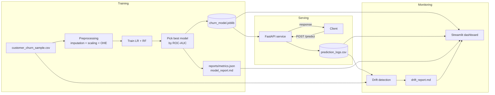

# ModelWatch-GCP

> Production-style MLOps pipeline for **customer churn prediction**, with model serving, prediction logging, data-drift detection, and a Streamlit monitoring dashboard. Designed to map cleanly onto Google Cloud (Cloud Run, Vertex AI, BigQuery, Cloud Monitoring) while running entirely locally for free.

[](./.github/workflows/tests.yml)
[](https://www.python.org/)
[](https://fastapi.tiangolo.com/)
[](https://streamlit.io/)

---

## 1. Project title

**ModelWatch-GCP: MLOps Pipeline for Model Serving, Drift Detection & Monitoring.**

## 2. Short description

ModelWatch-GCP is an end-to-end, GitHub-ready MLOps reference project. It trains a customer-churn classifier with Scikit-learn, serves it through a FastAPI REST API, logs every prediction, detects basic data drift between training and live traffic, and surfaces all of it in a Streamlit dashboard. The architecture is intentionally portable: you can run everything on a laptop, or move each component to its natural home on Google Cloud.

## 3. Business problem

Customer churn directly reduces revenue and inflates customer-acquisition cost. Telcos, SaaS companies, and subscription businesses need to (a) predict which customers are likely to churn, (b) act on those predictions in production, and (c) detect when the model's behavior degrades because the world has shifted. ModelWatch-GCP demonstrates all three concerns in a single, production-shaped repository.

## 4. Why this project matters for MLOps

A model isn't valuable until it's *served, monitored, and maintained*. This project demonstrates that full picture:

- **Reproducible training** with a stable random seed, a versioned model artifact, and saved metrics.
- **API-first serving** using FastAPI + Pydantic input validation.
- **Structured prediction logging** so downstream analysis is trivial.
- **Drift detection** comparing live inputs to the training distribution.
- **Observability** via a Streamlit dashboard with model metrics, logs, and drift status.
- **Test coverage** with pytest, including a FastAPI `TestClient` suite.
- **CI** via GitHub Actions.
- **Cloud-ready architecture** documented for GCP (Cloud Run, Vertex AI, BigQuery, Cloud Monitoring, Secret Manager).

## 5. Features

- Logistic Regression baseline + Random Forest, automatic best-model selection by ROC-AUC.
- Single `Pipeline` object that contains preprocessing **and** the classifier - no train/serve skew.
- `POST /predict` returns `{prediction, prediction_label, churn_probability, model_version}`.
- Every prediction is appended to `data/logs/prediction_logs.csv`.
- Numeric drift via normalized mean shift, categorical drift via total-variation distance.
- Per-feature `low/medium/high` drift status + auto-generated markdown report.
- 5-page Streamlit dashboard (Model Overview, Make Prediction, Logs, Drift, GCP Architecture).
- Dockerfile that runs cleanly on Cloud Run.
- pytest + GitHub Actions on Python 3.10 and 3.11.

## 6. Architecture



## 7. Tech stack

| Layer            | Choice                              |
|------------------|-------------------------------------|
| Language         | Python 3.10 / 3.11                  |
| ML framework     | Scikit-learn                        |
| API              | FastAPI + Pydantic v2 + Uvicorn     |
| Dashboard        | Streamlit                           |
| Plotting         | Matplotlib                          |
| Persistence      | joblib (model), CSV (logs)          |
| Testing          | pytest, FastAPI `TestClient`, httpx |
| CI               | GitHub Actions                      |
| Container        | Docker (slim Python base)           |
| Cloud target     | GCP (Cloud Run, Vertex AI, BigQuery, Cloud Monitoring, Secret Manager) |

## 8. Folder structure

```
modelwatch-gcp/
├── src/                       # core library
│   ├── config.py              # env-driven settings
│   ├── data_loader.py         # CSV loader + train/test split
│   ├── preprocessing.py       # ColumnTransformer pipeline
│   ├── train_model.py         # trains + selects best model
│   ├── evaluate_model.py      # metrics + markdown formatter
│   ├── predict.py             # cached model + predict_one()
│   ├── drift_detection.py     # numeric + categorical drift
│   ├── monitoring.py          # dashboard data adapters
│   ├── logger.py              # CSV prediction logger
│   └── utils.py               # logging + path helpers
├── api/fastapi_app.py         # /, /health, /predict
├── ui/streamlit_dashboard.py  # 5-page monitoring dashboard
├── data/
│   ├── raw/customer_churn_sample.csv
│   ├── processed/.gitkeep
│   └── logs/.gitkeep
├── models/.gitkeep            # joblib artifact lives here after training
├── reports/                   # model_card.md, model_report.md, drift_report.md
├── tests/                     # pytest suite
├── docs/                      # architecture, gcp plan, mlops workflow, etc.
├── .github/workflows/tests.yml
├── Dockerfile
├── requirements.txt
├── run_training.py
├── run_api.py
├── run_dashboard.py
├── .env.example               # NOTE: no real .env is committed
└── .gitignore
```

## 9. Dataset description

The repo ships a **synthetic** dataset at `data/raw/customer_churn_sample.csv` (1,500 rows). Columns:

| Column              | Type        | Description                                |
|---------------------|-------------|--------------------------------------------|
| `customer_id`       | string      | Synthetic id (e.g. `CUST-00042`). Not a feature. |
| `tenure_months`     | int         | Months as customer.                        |
| `monthly_charges`   | float       | Monthly bill in USD.                       |
| `total_charges`     | float       | Lifetime billed amount.                    |
| `contract_type`     | categorical | `Month-to-month`, `One year`, `Two year`.  |
| `internet_service`  | categorical | `DSL`, `Fiber optic`, `No`.                |
| `support_tickets`   | int         | Recent support tickets.                    |
| `payment_method`    | categorical | `Electronic check`, `Mailed check`, `Bank transfer`, `Credit card`. |
| `is_senior_citizen` | int (0/1)   | Senior flag.                               |
| `churn`             | int (0/1)   | Target label.                              |

Churn rate is approximately 27%. No real customer data is included anywhere in this repository.

## 10. Model training workflow

1. Load CSV from `data/raw/`.
2. Stratified 80/20 train/test split on the `churn` label.
3. Build a `ColumnTransformer`: numeric → median impute + standard scale; categorical → most-frequent impute + one-hot encode.
4. Train two pipelines:
   - Logistic Regression (`class_weight="balanced"`)
   - Random Forest (200 trees, balanced class weight)
5. Score both on the held-out test set with accuracy, precision, recall, F1, ROC-AUC and a confusion matrix.
6. Select the model with the **highest ROC-AUC**.
7. Save the full pipeline to `models/churn_model.joblib` and metrics to `reports/metrics.json` + `reports/model_report.md`.

## 11. API usage

Start the API: `uvicorn api.fastapi_app:app --reload`

```bash
curl -s -X POST http://127.0.0.1:8000/predict \
  -H "Content-Type: application/json" \
  -d '{
        "tenure_months": 12,
        "monthly_charges": 75.5,
        "total_charges": 906.0,
        "contract_type": "Month-to-month",
        "internet_service": "Fiber optic",
        "support_tickets": 3,
        "payment_method": "Electronic check",
        "is_senior_citizen": 0
      }'
```

Sample response:
```json
{
  "prediction": 1,
  "prediction_label": "Churn",
  "churn_probability": 0.82,
  "model_version": "v1.0.0"
}
```

Interactive docs: <http://127.0.0.1:8000/docs>.

## 12. Streamlit dashboard usage

```bash
streamlit run ui/streamlit_dashboard.py
```

Pages:

- **Model Overview** – metrics for both candidates, confusion matrix, feature list, model card.
- **Make Prediction** – form for one customer; result + logging.
- **Prediction Logs** – KPIs, recent log table, churn-probability histogram.
- **Drift Monitoring** – per-feature drift scores, overall status, distribution comparison.
- **GCP Architecture** – how each component maps onto Google Cloud.

## 13. Drift detection explanation

- **Numeric drift**: `|mean(ref) - mean(cur)| / std(ref)` (falls back to `max(|mean|, 1)` for zero-variance features).
- **Categorical drift**: total variation distance, `0.5 * Σ |p_ref - p_cur|`.
- Status buckets: `low` (< threshold), `medium` (< 2× threshold), `high` (≥ 2× threshold). Default threshold is `0.20`, override with `DRIFT_THRESHOLD`.
- A markdown report is written to `reports/drift_report.md` every time the dashboard's drift page is opened.
- The implementation is deliberately dependency-light. In a managed GCP deployment, swap this for **Vertex AI Model Monitoring**.

## 14. Local setup

```bash
git clone <your-fork-url>
cd modelwatch-gcp
python -m venv .venv && source .venv/bin/activate
pip install -r requirements.txt
cp .env.example .env   # OPTIONAL - only if you want to override defaults
```

## 15. How to train the model

```bash
python run_training.py
```

Writes `models/churn_model.joblib`, `reports/metrics.json`, `reports/model_report.md`.

## 16. How to run the API

```bash
uvicorn api.fastapi_app:app --reload
# or
python run_api.py
```

Health check: `curl http://127.0.0.1:8000/health`.

## 17. How to run the dashboard

```bash
streamlit run ui/streamlit_dashboard.py
# or
python run_dashboard.py
```

## 18. How to run tests

```bash
pytest -v
```

The test suite trains a small model in a temp directory, so it does not touch your real `models/` folder. **No cloud credentials are required.**

## 19. Docker usage

```bash
# Build (after training so the model is in the image)
python run_training.py
docker build -t modelwatch-gcp:latest .

# Run
docker run --rm -p 8000:8000 modelwatch-gcp:latest

# Health check
curl http://127.0.0.1:8000/health
```

## 20. GCP deployment plan (summary)

| Concern              | GCP service                       |
|----------------------|-----------------------------------|
| Hosting the API      | **Cloud Run** (this Dockerfile is Cloud-Run-ready). |
| Training jobs        | **Vertex AI Custom Training** or Cloud Run Jobs. |
| Model storage        | **Cloud Storage** + **Vertex AI Model Registry**. |
| Prediction logs      | **BigQuery** streaming inserts (replace CSV). |
| App logs             | **Cloud Logging** (captures container stdout/stderr). |
| Metrics + alerts     | **Cloud Monitoring** with custom drift metrics. |
| Secrets              | **Secret Manager**, mounted as env vars in Cloud Run. |
| Periodic drift jobs  | **Cloud Scheduler** triggering a Cloud Run Job. |

Full plan: [`docs/gcp_deployment_plan.md`](docs/gcp_deployment_plan.md).

## 21. Security notes

- **This project uses synthetic data only.** Do not commit real customer data.
- **Do not commit `.env`.** Only `.env.example` is tracked. Real secrets belong in Google Secret Manager.
- **Do not commit production prediction logs.** `data/logs/*` is gitignored.
- Pydantic validates all API inputs; the API never echoes the original request body in error messages.
- For real deployments on Cloud Run, mount secrets via **Secret Manager**, not env files.
- For Vertex AI, prefer **Model Registry + Model Monitoring** over a local joblib + CSV pair.

## 22. Limitations

- The dataset is synthetic, so absolute metric values are not meaningful.
- The drift detector is a simple statistical baseline; for production, use a managed service or a richer test (e.g. KS-test, PSI, Wasserstein).
- The prediction log is a CSV file - fine for a demo, not for high-QPS production. Replace with BigQuery.
- No authentication on the API in local mode. Add an API gateway / IAM in production.

## 23. Future improvements

- Replace `data/logs/prediction_logs.csv` with **BigQuery** streaming inserts.
- Wire the model artifact through **Vertex AI Model Registry**.
- Add **PSI / KS-statistic** drift, plus prediction drift on the model's output.
- Add a retraining trigger (Cloud Scheduler + Cloud Run Job) gated on drift status.
- Add structured JSON logging compatible with Cloud Logging.
- Add Terraform manifests for the full GCP stack.

## 24. Resume bullet

> Built **ModelWatch-GCP**, a production-style MLOps pipeline in Python that trains a customer-churn model with Scikit-learn, serves it via FastAPI, logs every prediction, detects data drift with custom statistical tests, and visualizes everything in a Streamlit dashboard. Includes a Cloud-Run-ready Dockerfile, pytest + GitHub Actions CI, and a documented GCP deployment plan mapping the stack to Cloud Run, Vertex AI, BigQuery, Cloud Logging, Cloud Monitoring and Secret Manager.

## 25. GitHub push checklist

Before `git push`:

- [ ] `.env` is **not** present (or is in `.gitignore`).
- [ ] No secrets or credentials in any file.
- [ ] No real customer data in `data/raw/`.
- [ ] No real prediction logs in `data/logs/`.
- [ ] `models/churn_model.joblib` either small enough to commit, or excluded via `.gitignore` with regeneration instructions in this README.
- [ ] `pytest -v` passes locally.
- [ ] `docker build .` succeeds.
- [ ] README and `docs/` reflect the current behavior.
