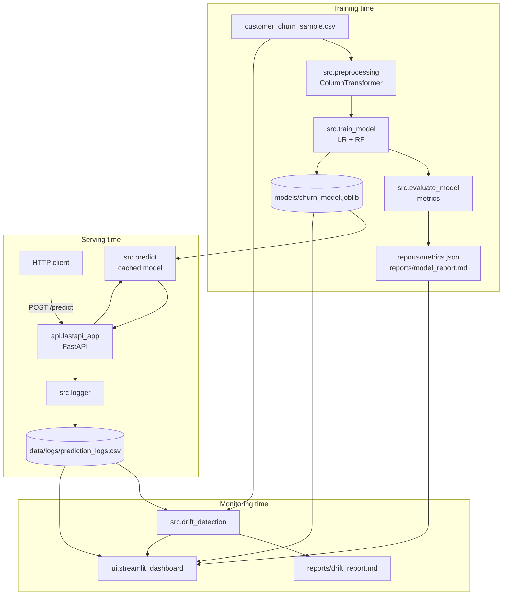

# Architecture

This document describes how the moving parts of ModelWatch-GCP fit together. The repository is organized as a thin layered architecture: a `src/` library, two thin entry-points (`api/`, `ui/`), and a `tests/` suite.

## High-level diagram

## Components

### `src/config.py`
Single source of truth for paths and thresholds. Reads environment variables (with `.env` support via `python-dotenv`). Exposes a frozen `Settings` dataclass and a module-level singleton `SETTINGS` so it can be imported anywhere safely.

### `src/data_loader.py`
Loads `data/raw/customer_churn_sample.csv`, validates schema, and provides a stratified train/test split. Returns `pandas.DataFrame`/`pandas.Series` to keep downstream code framework-agnostic.

### `src/preprocessing.py`
Builds a `sklearn.compose.ColumnTransformer` that handles imputation, scaling and one-hot encoding. The transformer is bundled into the final `Pipeline` so the same logic runs at train and serve time.

### `src/train_model.py`
Trains the candidate models, computes test-set metrics, selects the best by ROC-AUC, and persists the model + metrics + markdown report.

### `src/evaluate_model.py`
Pure functions for computing classification metrics and rendering them as markdown.

### `src/predict.py`
Loads the model lazily and caches it in module state. Validates that the request payload contains all required features. Returns a `dict` shaped to match the FastAPI response model.

### `src/drift_detection.py`
Pure pandas/numpy drift checks - normalized mean shift for numeric features, total variation distance for categoricals. Outputs both a list of structured results and a human-readable markdown report.

### `src/logger.py`
Appends one row per prediction to `data/logs/prediction_logs.csv`. Thread-safe in a single process via a module-level lock. Uses a stable column ordering so downstream analysis is reliable.

### `src/monitoring.py`
Adapter layer for the dashboard. Reads metrics JSON, the model card, prediction logs, and orchestrates drift evaluation.

### `api/fastapi_app.py`
Three endpoints (`/`, `/health`, `/predict`) plus a global exception handler. Pydantic v2 schemas validate inputs and document the API at `/docs`.

### `ui/streamlit_dashboard.py`
Pure-Streamlit UI with five pages. No HTML/CSS/JS is used. Plotting is via matplotlib + Streamlit's native chart helpers.

## Data flow

1. Training reads the CSV, fits a `Pipeline`, and writes `churn_model.joblib`.
2. The API loads the pipeline on the first request and serves predictions; each prediction is appended to the CSV log.
3. The dashboard reads metrics, logs and reference data, runs drift detection on demand and renders the result.

## Design choices

- **Single Pipeline object**: avoids train/serve skew - preprocessing always travels with the model.
- **Stable columns in logs**: makes drift detection trivial; you can swap CSV for BigQuery without touching downstream code.
- **No global state**: `src/config.py` is the only module that loads env vars, and the model cache lives behind a small API in `src/predict.py`.
- **No HTML/CSS/JS**: the dashboard is pure Python Streamlit so the project stays purely Pythonic.
