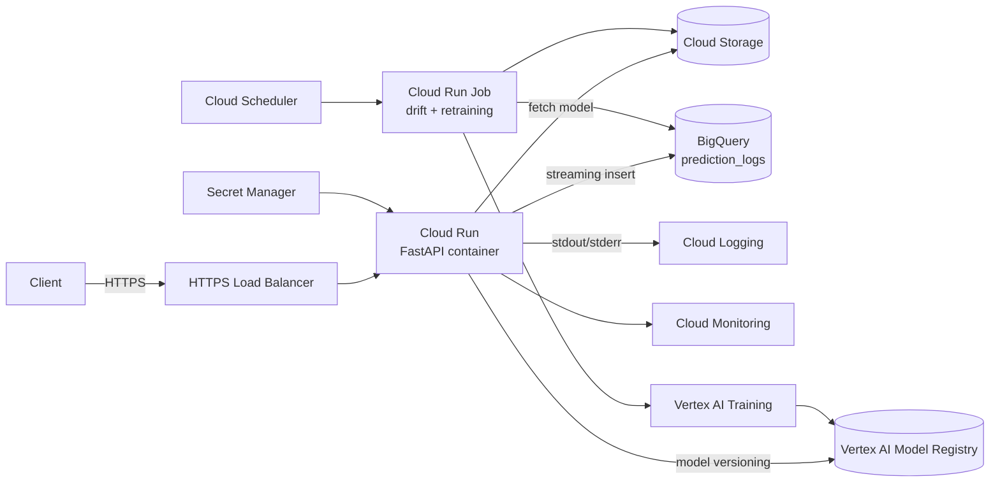

# GCP Deployment Plan

This document describes how ModelWatch-GCP maps onto Google Cloud for a production deployment. The local-mode behavior is preserved (the codebase still runs on a laptop), but each component has a managed-service counterpart.

## Target architecture

## Service-by-service mapping

### Cloud Run – serving
- Container is the Dockerfile in this repo (already exposes `$PORT`).
- Set min-instances=0 for cost efficiency, max-instances to bound spend.
- Configure `MODEL_VERSION`, `DRIFT_THRESHOLD`, `PREDICTION_LOG_TABLE` as environment variables.
- Mount secrets (e.g. service account credentials when accessing BigQuery from outside Cloud Run's default identity) from Secret Manager.

### Vertex AI – training + registry + (optional) endpoint
- Replace `python run_training.py` with a Vertex AI Custom Training job that runs the same code (mount the source from Cloud Storage or use a container image).
- Push the resulting model to Vertex AI Model Registry; tag with the same `MODEL_VERSION` the API reports.
- Optionally deploy to a Vertex AI Endpoint instead of Cloud Run. Vertex Endpoints include **Vertex AI Model Monitoring**, which replaces `src/drift_detection.py`.

### Cloud Storage – artifacts
- Buckets: `gs://<project>-modelwatch-data` (raw + processed), `gs://<project>-modelwatch-models` (joblib artifacts), `gs://<project>-modelwatch-reports`.
- Lifecycle policies on logs and processed snapshots (e.g. 90-day retention).

### BigQuery – prediction logs
- Dataset: `modelwatch`, table: `prediction_logs`.
- Schema mirrors the CSV columns in `src/logger.py`: `timestamp`, `model_version`, one column per feature, `prediction`, `prediction_label`, `churn_probability`.
- Stream inserts from the API via the `google-cloud-bigquery` client (swap in for the CSV writer behind the existing `log_prediction` interface).

### Cloud Logging – application logs
- Container stdout/stderr is captured automatically. The project already logs through `src/utils.get_logger`, so no code changes are required.
- Add log-based metrics for `ERROR` count and slow requests.

### Cloud Monitoring – health metrics + drift
- Built-in metrics: request count, latency p50/p95/p99, error rate, container CPU/memory.
- Custom metric: write drift status (0/1/2 for low/medium/high) from the scheduled drift job.
- Alert policies: error-rate > 5% for 5 minutes; drift status == high for 2 consecutive runs.

### Secret Manager – secrets
- Store DB credentials, third-party API keys, and rotation-friendly settings.
- Never use a committed `.env` file in production. The repository's `.env.example` documents the keys.

### Cloud Scheduler – periodic drift jobs
- Cron: `0 */6 * * *` (every 6 hours) triggers a Cloud Run Job that:
  1. Pulls recent prediction logs from BigQuery,
  2. Loads the reference snapshot from Cloud Storage,
  3. Runs `src.drift_detection.detect_drift`,
  4. Writes the drift report back to Cloud Storage and a custom metric to Cloud Monitoring,
  5. Optionally invokes a retraining Vertex AI Pipeline if drift is `high`.

## Networking and IAM

- Cloud Run service uses a dedicated service account with **minimum** scopes:
  - `roles/storage.objectViewer` on the models bucket.
  - `roles/bigquery.dataEditor` on the `modelwatch` dataset.
  - `roles/secretmanager.secretAccessor` on the relevant secrets.
- Optionally put Cloud Run behind an HTTPS Load Balancer + IAP if the API is internal.

## CI/CD

- GitHub Actions on `main` builds the Docker image and pushes it to Artifact Registry.
- A second job runs `gcloud run deploy` with `--image` pointing at the new tag.
- Tests gate the deploy step.

## Estimated cost profile

- Cloud Run: per-request pricing, $0 at idle.
- BigQuery: streaming inserts are billed per row + storage; with low traffic this is a few dollars/month.
- Vertex AI Training: pay per training job; trivial for this dataset size.
- Secret Manager + Cloud Scheduler: pennies per month.

## Migration steps (suggested order)

1. Containerize the API (already done) and deploy to Cloud Run.
2. Move secrets from `.env` to Secret Manager.
3. Replace CSV logging with BigQuery streaming inserts.
4. Push model artifacts to Cloud Storage and Vertex AI Model Registry.
5. Replace `run_training.py` with a Vertex AI training job.
6. Add Cloud Scheduler + Cloud Run Job for periodic drift detection.
7. Add Cloud Monitoring alerts and a dashboard.
